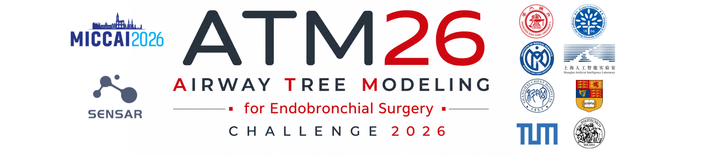

# Airway Tree Modeling 2026 (ATM26) Challenge Benchmark

Building on the success of [ATM22 challenge](https://github.com/EndoluminalSurgicalVision-IMR/ATM-22-Related-Work), we further extend the airway tree modeling domain toward anatomical labeling and endobronchial intervention.

## ATM26 Challenge Collection
### Registration
Please refer to the [Registration Page](https://atm26.grand-challenge.org/registration/) for detailed registration information and guidelines.

**NOTE**: All verified participants must click the "Join" button on the website, as well as sign the Data Usage Agreement, as specified by the registration guideline. 

### Baseline and Submission Guideline
We provide a baseline model and a detailed docker tutorial. Please refer to [Baseline and Submission Guideline](baseline-and-submission-guideline/README.md) for details.

### Evaluation
The evaluation code can be found in.

## TODOs
- [ ] Upload baseline weights and nnUNet docker image 
- [ ] Prepare the release of Track-3

## Related Works