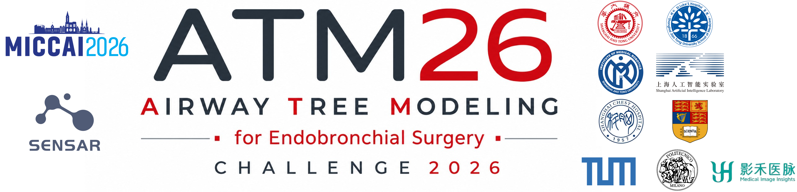

# Airway Tree Modeling for Endobronchial Surgery 2026 (ATM'26) Challenge Benchmark


[](https://opensource.org/licenses/MIT)



Building on the success of [ATM22](https://github.com/EndoluminalSurgicalVision-IMR/ATM-22-Related-Work) challenge, [ATM26](https://atm26.grand-challenge.org/) extends airway tree modeling from binary segmentation to structured airway understanding, supporting clinically meaningful airway segmentation and branch-wise anatomical labeling, as well as endobronchial intervention.

## ATM26 Challenge Collection
### Registration
Please refer to the [Registration Page](https://atm26.grand-challenge.org/registration/) for detailed registration information and guidelines.

**NOTE**: All verified participants must click the "Join" button on the website, as well as sign the Data Usage Agreement, as specified by the registration guideline.

### Baseline and Submission Guideline
We provide a baseline model and a detailed docker tutorial. Please refer to [Baseline and Submission Guideline](baseline-and-submission-guideline/README.md) for details.

### Evaluation
The evaluation code can be found in [Evaluation](evaluation/README.md).

## TODOs
- [x] Upload baseline weights and nnUNet docker image
- [x] Prepare evaluation README
- [ ] Prepare the release of Track-3

## Citation
If using this dataset, you must cite the papers:
```bibtex
@article{zhang2023multi,
  title={Multi-site, multi-domain airway tree modeling},
  author={Zhang, Minghui and Wu, Yangqian and Zhang, Hanxiao and Qin, Yulei and Zheng, Hao and Tang, Wen and Arnold, Corey and Pei, Chenhao and Yu, Pengxin and Nan, Yang and others},
  journal={Medical image analysis},
  volume={90},
  pages={102957},
  year={2023},
  publisher={Elsevier}
}
```

```bibtex
@article{li2025reflecting,
  title={Reflecting topology consistency and abnormality via learnable attentions for airway labeling},
  author={Li, Chenyu and Zhang, Minghui and Zhang, Chuyan and Gu, Yun},
  journal={International Journal of Computer Assisted Radiology and Surgery},
  volume={20},
  number={7},
  pages={1315--1323},
  year={2025},
  publisher={Springer}
}
```

```bibtex
@article{zhang2024airmorph,
  title={Airmorph: Topology-preserving deep learning for pulmonary airway analysis},
  author={Zhang, Minghui and Li, Chenyu and Xie, Fangfang and Liu, Yaoyu and Zhang, Hanxiao and Wu, Junyang and Zhang, Chunxi and Yang, Jie and Sun, Jiayuan and Yang, Guang-Zhong and others},
  journal={arXiv preprint arXiv:2412.11039},
  year={2024}
}
```