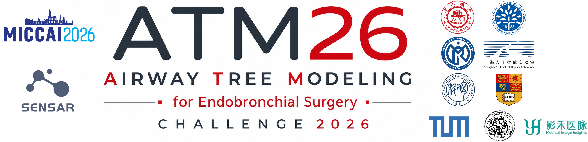

## Baseline and Submission Guideline



We provide the official example algorithm and our baseline algorithm in this directory. Participants are expected to pack their own solutions, configure their docker image correctly and then build the docker image.

Baseline checkpoints can be found on [Huggingface](https://huggingface.co/Endoluminal-Surg-Vision-IMR/Airway-Tree-Modeling-26-baselines). You can download and replace the corresponding files and folders.

If you would like to use the nnUNet docker, you can pull from Docker Hub:
```bash
docker pull kkdls19/atm26-nnunetv2:2.6.4
```

### Track-1: Binary Airway Segmentation
An example algorithm for Track-1 can be found under `T1_example_algorithm`. It defines the I/O interface for accessing lung CT images on Grand Challenge platform.

The corresponding baseline algorithm for Track-1 can be found under `T1_baseline`. It follows the I/O interface provided by Grand Challenge platform and pack an nnUNet model as solution.

Please carefully configure the `Dockerfile` before docker image saving and testing.

To build and test the docker, you can run:
```bash
cd baseline-and-submission-guideline/T1_baseline
bash do_test_run.sh
```

To build and save the docker, you can run:
```bash
cd baseline-and-submission-guideline/T1_baseline
bash do_save.sh
```

### Track-2: Branch-wise Anatomical Labeling
An example algorithm for Track-2 can be found under `T2_example_algorithm`. It defines the I/O interface for accessing lung CT images on Grand Challenge platform.

The corresponding baseline algorithm for Track-2 can be found under `T2_baseline`. It follows the I/O interface provided by Grand Challenge platform and pack an nnUNet model as solution.

Please carefully configure the `Dockerfile` before docker image saving and testing.

To build and test the docker, you can run:
```bash
cd baseline-and-submission-guideline/T2_baseline
bash do_test_run.sh
```

To build and save the docker, you can run:
```bash
cd baseline-and-submission-guideline/T2_baseline
bash do_save.sh
```
### Batch execution (Validation & Final Test phases)

The batch contract below applies to **both the Validation Phase and the Final Test
Phase** — the submission images are identical; only the phase/leaderboard that receives
the upload differs. Three folders are provided:

- `finaltest_batch_template` — the generic Docker packing template for the ATM26 local
  evaluation platform's batch contract. On the real Grand-Challenge platform the
  container receives ONE case and behaves like a standard per-case algorithm; on our
  ATM26 local inference + evaluation platform (Validation or Final Test phase) it
  receives the whole test set under `/input` and performs internal sequential inference
  (model loaded ONCE, per-case loop with explicit GPU-VRAM/memory hygiene).
- `T1_baseline_finaltest_batch` / `T2_baseline_finaltest_batch` — the official
  leaderboard baselines repackaged with the batch contract. Prediction code is unchanged
  from `T1_baseline` / `T2_baseline`; checkpoints come from the same
  [Huggingface](https://huggingface.co/Endoluminal-Surg-Vision-IMR/Airway-Tree-Modeling-26-baselines)
  locations.
- `nnunetv2-base/` — the slim CUDA 11.8 base-image recipe these folders build on.

Key batch-contract rules (the platform enforces these):

- The Dockerfile **must** declare `LABEL org.atm26.batch="1"` (selects batch execution;
  without it the platform runs your image per case) and
  `LABEL org.grand-challenge.api-method="exec"`.
- The container reads all `*.mha` files under `/input/images/lung-ct` itself and writes
  **one output per case** to `/output/images/<output-slug>/<case-id>.mha`. In batch mode it
  must NOT write `output.mha`; the per-case stem is `<case>`, `<case>_0000`, or the
  platform-assigned job id.
- The submitter-facing output format is **per-case `.mha`** (NOT `.nii.gz`): uint8 pixel
  data embedded in the file (`ElementDataFile=LOCAL`), compressed. Exactly one file per
  case, no extras, no duplicates.
- Rule of thumb: with exactly ONE case at `/input`, the same image writes
  `/output/images/<output-slug>/output.mha` and behaves like the standard per-case
  baseline, so one image serves both the Grand Challenge platform and our platform's
  batch runs.

**The evaluation platform's GPU driver supports CUDA up to 12.0**; the batch folders build
on the slim `atm26-nnunetv2:2.6.4-cuda11.8` base whose Dockerfile is provided in
`nnunetv2-base/` (cuda12.4-based images will not run on the platform).

For the **Validation Phase** you use the exact same folders and commands: build your image
with the template/baseline scripts and upload it to the phase you are submitting to
(Validation Phase on the challenge site; Final Test Phase via the Google Form / off-GC
submission) — our local evaluation platform runs both with the same batch contract.
